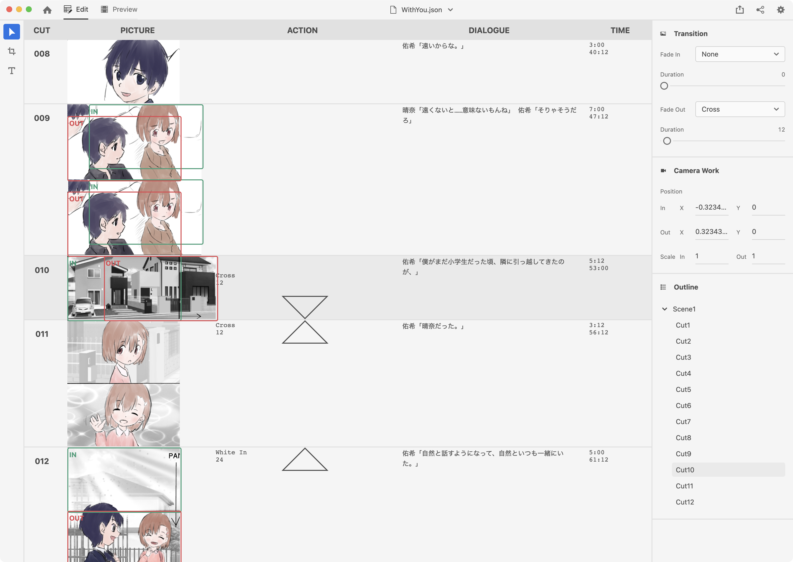
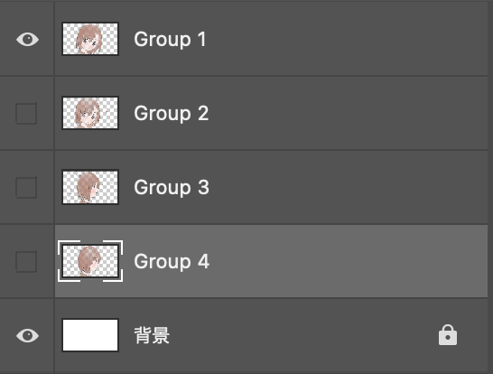

Welcome to MizutamaConte by Studio Mizutama.
日本語版READMEは[こちら](README.md)

# Mizutama Conte [\[Demo Site\]](https://studio-mizutama.github.io/MizutamaConte/)



This is the storyboard management app build with React + Electron.
Currently only viewer part is available.

## Usage

### Install

```sh
$ yarn
```

### Development

```sh
$ yarn electron:dev
```

### Build

```sh
$ yarn electron:build
```

### Deploy GitHub Pages

```sh
$ yarn deploy
```

## Feature

- [x] Display Storyboard file
- [ ] Edit/Save/Overwrite
- [ ] Open new project
- [ ] Interact with external drawing apps
- [x] Play the storyboard
- [ ] Export storybord to the video
- [ ] Setup user preference with `setting.json`

## storyboard file 

MizutamaConte manages your storyboard with json and psd file.

```sh
conte/
├── [Your Project Name].json
│
├── c001.psd
├── c002.psd
├── c003.psd
├──   .
├──   .
├──   .
└──   .
```

### json file structure

Examle below based on [With You](https://youtu.be/sva7WjdEO7k)

```json
[
  {
    "action": { "fadeIn": "Black In", "fadeInDuration": 96 },
    "dialogue": "佑希「楽しみだな！」晴奈「そうだね」",
    "time": 168
  },
  {
    "cameraWork": {
      "position": { "in": { "x": 0, "y": 0 }, "out": { "x": -0.421875, "y": 0 } },
      "scale": { "in": 1.421875, "out": 1 }
    },
    "dialogue": "佑希「僕と晴奈は飛行機に乗っている。何でかっていうと、色々とあるんだ。」",
    "time": 156
  },
  {
    "cameraWork": {
      "position": { "in": { "x": 0, "y": 0 }, "out": { "x": 0, "y": 0 } },
      "scale": { "in": 1.269792, "out": 1 }
    },
    "dialogue": "佑希「まぁ一言で言えば駆け落ちみたいなもの。」",
    "time": 72
  },
  {
    "cameraWork": {
      "position": { "in": { "x": 0, "y": 0 }, "out": { "x": 0, "y": 0 } },
      "scale": { "in": 1, "out": 1.316145 }
    },
    "dialogue": "佑希「大学もあと卒業研究だけだったのに、ほっぽり出してきた。」",
    "time": 132
  },
  { "dialogue": "佑希「それぐらい晴奈が好きなんだけどさ……」", "time": 72 },
  { "dialogue": "佑希「これできっとよかったんだ」", "time": 228 },
]
```
-> Treated as a `Cut` type object. 

```ts
interface Cut {
  picture?: Psd;
  cameraWork?: CameraWork;
  action?: Action;
  dialogue?: string;
  time?: number;
}

interface Action {
  fadeIn?: 'None' | 'White In' | 'Black In' | 'Cross';
  fadeInDuration?: number;
  fadeOut?: 'None' | 'White Out' | 'Black Out' | 'Cross';
  fadeOutDuration?: number;
  text?: string;
}

interface CameraWork {
  position?: { in: { x: number; y: number }; out: { x: number; y: number } };
  scale?: { in: number; out: number };
}
```

`Psd` type uses [ag-psd](https://github.com/Agamnentzar/ag-psd)

### psd file structure



#### canvas size
Will be set as the same size with actual Anime e.g. 1920\*1080

#### Layer structure
- Place the background layer at the bottom
- If there are multiple frames in the same cut, place them according to the time series
- Assuming there is one layer per each frames (will enhance the feature as one group per each frames in our future update)
- Layer name is variable
- Hidden layes will also be fetched

### Sample storyboard file

Samples are available for download from below link.

**This sample is NOT under MIT License. ©︎ 2020 Studio Mizutama All Rights Reserved.**

[Google Drive](https://drive.google.com/drive/folders/11lSAHkNsDDrYayZGV87AM5X9dPsFVYGa?usp=sharing)

In Electron edition, navigate to `File -> Open` `(Cmd or Ctrl + O)`
In [Web Edition](https://studio-mizutama.github.io/MizutamaConte/), click the folder icon in upper left corner and select the folder contains the sample. 

## Many thanks to

[yhirose/react-typescript-electron-sample-with-create-react-app-and-electron-builder](https://github.com/yhirose/react-typescript-electron-sample-with-create-react-app-and-electron-builder)
