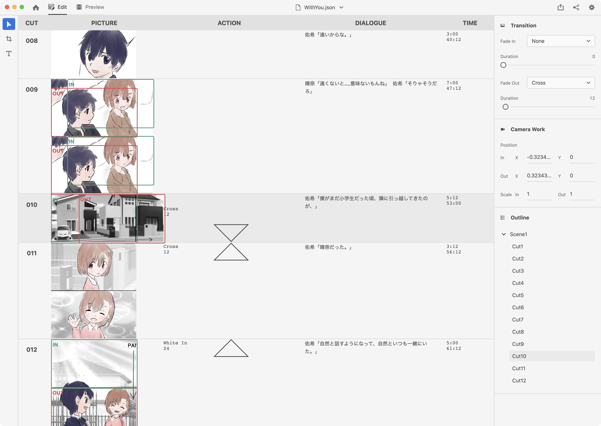
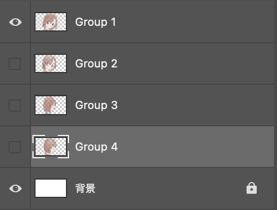

Mizutama Conte へようこそ。
English: [README.en.md](README.en.md) ／ 한국어: [README.ko.md](README.ko.md)

# Mizutama Conte [\[Web App\]](https://studio-mizutama.github.io/MizutamaConte/)



React + Electron 製の絵コンテエディタです。解像度・アスペクト比の設定、カメラワーク付きのビデオコンテプレビュー、PSD + JSON での保存、PDF / 動画書き出し、Undo / Redo などを備えています。カメラワークを付けたままプレビュー再生できるのが、このアプリの特徴です。

> この README は開発者向けです。インストール手順や使い方などのエンドユーザー向けドキュメントは[ドキュメントサイト](https://studio-mizutama.github.io/MizutamaConte/docs/)にあります。

## Usage（開発者向け）

### Install

```sh
$ yarn
```

### Development

```sh
$ yarn dev      # Electron 版（Mac / Win / Linux）
$ yarn dev:web  # Web 版（http://localhost:3000）
```

### Build

```sh
$ yarn build      # Electron 版（out/ に出力）
$ yarn build:web  # Web 版（build/ に出力）
$ yarn build:docs # ドキュメントサイト（build/docs/ に出力）
```

### Deploy（GitHub Pages）

```sh
$ yarn deploy     # build:web + build:docs を gh-pages ブランチへ公開
```

### Verify

```sh
$ yarn test       # vitest（純粋関数のユニットテスト）
$ yarn typecheck  # renderer + electron の型チェック
```

> **配布ビルドは未署名**です。このリポジトリで生成する配布ビルドはコード署名・公証を行っていません。macOS の quarantine 回避など、エンドユーザー向けの導入案内はドキュメントサイトに記載しています。

## 主な機能

- 絵コンテの表示・編集（PSD + JSON、1.5s デバウンスの自動保存）
- 新規プロジェクト作成（解像度・アスペクト比を選択）／脚本（.md）からの新規作成
- キャンバスのリサイズ（方向に応じたデフォルトカメラワークの自動生成）
- カメラワーク編集と、カメラワーク付きのビデオコンテプレビュー
- トランジション（フェードイン・フェードアウト・クロスフェード）
- ストップウォッチによる TIME 入力
- 外部ペイントアプリ連携（CLIP STUDIO PAINT / Photoshop / Affinity / GIMP / Krita）
- 書き出し: PDF（絵コンテ印刷）/ 動画（MP4・H.264）
- Undo / Redo
- CUT / SCENE の並べ替え（ドラッグ&ドロップ）
- ローカル git 連携（任意・上級者向け）
- 最近開いたプロジェクト
- 多言語（日本語 / 韓国語 / 英語）、ライト / ダーク / システム テーマ
- Web 版は PWA としてインストール可能（Chromium 系ブラウザ）
- `settings.json` によるユーザー設定

## 絵コンテファイル

Mizutama Conte は、絵コンテを 1 つの JSON ファイルと複数の PSD ファイルで管理します。

```sh
conte/
├── [プロジェクト名].json
│
├── c001.psd
├── c002.psd
├── c003.psd
└──   ...
```

### JSON の構成

保存される JSON は `ProjectFile`（v2）です。各カットは `rows`（PSD レイヤーに順序対応する行）を持ち、セリフは行単位で保持します。

```json
{
  "version": 2,
  "title": "君と一緒に",
  "settings": {
    "aspect": "16:9",
    "resolution": "FHD",
    "frame": { "width": 1920, "height": 1080 },
    "fps": 24
  },
  "cuts": [
    {
      "id": "c1",
      "sceneStart": { "title": "Scene 1" },
      "psd": "c001.psd",
      "time": 168,
      "action": { "fadeIn": "Black In", "fadeInDuration": 96 },
      "rows": [
        { "id": "r1", "layer": "1", "dialogue": "佑希「楽しみだな！」晴奈「そうだね」", "canvas": { "width": 1920, "height": 1080 } }
      ]
    },
    {
      "id": "c2",
      "psd": "c002.psd",
      "time": 156,
      "cameraWork": {
        "position": { "in": { "x": 0, "y": 0 }, "out": { "x": -0.421875, "y": 0 } },
        "scale": { "in": 1.421875, "out": 1 }
      },
      "rows": [
        { "id": "r2", "layer": "1", "dialogue": "佑希「僕と晴奈は飛行機に乗っている。…」", "canvas": { "width": 1920, "height": 1080 } }
      ]
    }
  ]
}
```

型は以下のとおりです（`src/project/types.ts`、`src/@types/global.d.ts`）。

```ts
interface ProjectFile {
  version: 2;
  title: string;
  settings: ProjectSettings;
  cuts: ProjectCut[];
}

interface ProjectSettings {
  aspect: '4:3' | '16:9' | '1.85:1' | '2.39:1';
  resolution: 'SD' | 'HD' | 'FHD' | '2K' | '4K';
  frame: { width: number; height: number };
  fps: number;
}

interface ProjectCut {
  id: string;
  sceneStart?: { title?: string }; // このカットで新しいシーンが始まる
  psd?: string;                    // プロジェクトフォルダ相対の PSD ファイル名
  time?: number;                   // デュレーション（フレーム数）
  action?: Action;
  cameraWork?: CameraWork;
  rows: CutRow[];
}

interface CutRow {
  id: string;
  layer: string;                   // PSD レイヤー名（読み込みは順序でマップ）
  dialogue?: string;
  canvas: { width: number; height: number };
}

interface Action {
  fadeIn?: 'None' | 'White In' | 'Black In' | 'Cross';
  fadeInDuration?: number;
  fadeOut?: 'None' | 'White Out' | 'Black Out' | 'Cross';
  fadeOutDuration?: number;
  text?: string;
}

interface CameraWork {
  position?: { in: { x: number; y: number }; out: { x: number; y: number } };
  scale?: { in: number; out: number };
}
```

旧スキーマ（v1・フラットな配列形式）のファイルも、読み込み時に v2 へ自動変換されます。PSD のパースには [ag-psd](https://github.com/Agamnentzar/ag-psd) を使っています。

### PSD の構成



#### キャンバスサイズ

実際のアニメと同じサイズで作ります（1920×1080 など）。

#### レイヤー構成

- 最下層を背景レイヤーにします（絵を描いた背景も描画されます）。
- 同一カット内に複数コマがある場合は、時系列順に下から並べます。
- 1 コマ = 1 レイヤー、または **1 コマ = 1 グループ**（グループは合成して 1 コマとして扱います）。
- レイヤーのブレンドモード・不透明度・クリッピングも反映されます。
- レイヤー名は任意です（読み込みは順序でマップします）。
- 非表示レイヤーも読み込まれます。

### サンプル

サンプルファイルを以下からダウンロードできます。

**This sample is NOT under BSL 1.1 nor Apache 2.0 License. ©︎ 2020 Studio Mizutama All Rights Reserved.**

[Dropbox](https://www.dropbox.com/scl/fo/3qync4e9u8eew9jvjmj53/AOZaBZuIr57tLwGSNW42fss?rlkey=3kdow3hlw9pt0hdfors67capl&st=ml747cld&dl=0)

Electron 版では `File -> Open`（`Cmd / Ctrl + O`）、[Web 版](https://studio-mizutama.github.io/MizutamaConte/)では左上のフォルダアイコンから、ダウンロードしたサンプルをフォルダごと選択してください。

## License

Mizutama Conte は **Business Source License 1.1 (BSL 1.1)** で提供されます。各バージョンは公開から 4 年後に自動的に Apache License 2.0 へ移行します。

- **無料で使えるケース**: 同人（有償頒布を含む）・映画祭・単館上映・個人チャンネル（収益化を含む）・教育/非商用、そしてツールでコンテを描く行為そのもの。
- **商用ライセンスが必要なケース**: 制作した作品を地上波/衛星/ケーブル放送、商用ストリーミング配信、または全国規模（10 館超）の劇場で一般公開する場合。支払うのは公開を仕切る側（製作委員会・配給など）で、ツールを使った制作者個人・下請けスタジオは常に無料です。
- 詳細は [LICENSING.md](LICENSING.md) と [LICENSE](LICENSE) を参照してください。

「Mizutama Conte」「Studio Mizutama」の名称・ロゴ・公式ビルドの署名は商標であり、ライセンスの対象外です（4 年後の Apache 移行後も同様）。

> 過去に公開されたプレビュー版（プロトタイプ）は MIT ライセンスで配布されており、その版は引き続き MIT のままです。
